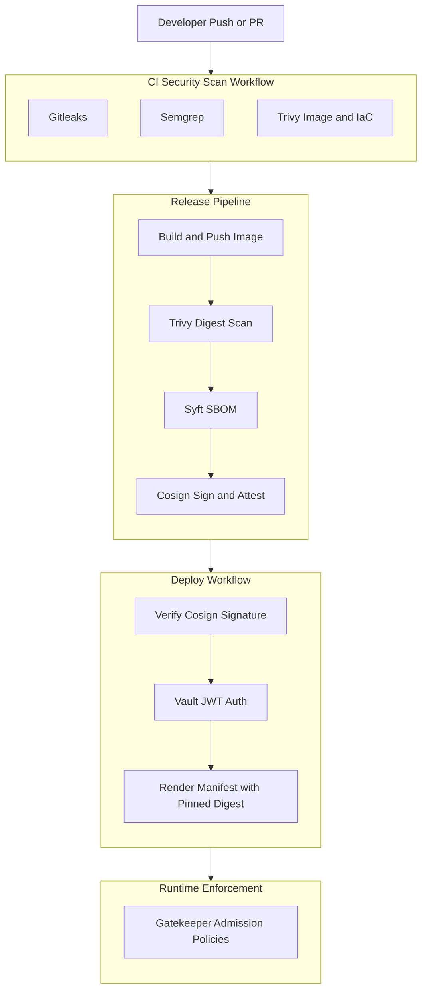

# DevSecOps Hardened Pipeline

Reusable GitHub Actions workflows secure, sign, attest, and prepare deployment of a small Flask service while documenting the tradeoffs behind each control.

## Architecture



## Security Controls

| Tool | What it protects | Threat addressed | Where it runs |
| --- | --- | --- | --- |
| Gitleaks | Git history and staged commits | Secret sprawl and accidental credential commits | Pre-commit and CI |
| Semgrep | Application source code | Taint-style command injection paths plus advisory SAST findings | CI |
| Trivy | Container image and Kubernetes manifests | Vulnerable packages and insecure deployment configuration | CI and release |
| Syft | Released container image | Missing software inventory and weak incident response visibility | Release |
| Cosign | Pushed image and SBOM attestation | Registry tampering and unsigned deployment artifacts | Release and deploy |
| Vault JWT auth | Deployment-time secret access | Static CI secrets and long-lived tokens | Deploy |
| Gatekeeper | Cluster admission layer | Non-root, resource-limit, and image provenance policy drift | Cluster |

## Why These Decisions

- Deployment target strategy: [ADR-001](docs/architecture/ADR-001-deployment-target.md)
- Keyless signing: [ADR-002](docs/architecture/ADR-002-keyless-signing-vs-keypair.md)
- Vault auth method: [ADR-003](docs/architecture/ADR-003-vault-auth-method.md)
- Gatekeeper policy scope: [ADR-004](docs/architecture/ADR-004-opa-policy-scope.md)
- SBOM format selection: [ADR-005](docs/architecture/ADR-005-sbom-format-selection.md)

## Repository Layout

```text
.
├── .github/workflows
├── docs/architecture
├── docs/threat-model.md
├── k8s
├── policies/gatekeeper
├── policies/semgrep
├── src
└── vault/config
```

## Local Run

```bash
python3 -m venv .venv
source .venv/bin/activate
pip install -r src/requirements.txt
python3 src/app.py
```

The service exposes:

- `GET /healthz`
- `GET /readyz`
- `GET /api/v1/info`

## Local Security Checks

```bash
docker build -t devsecops-demo:local .
python3 scripts/query-sbom.py sbom.cyclonedx.json
```

```bash
pre-commit run --all-files
semgrep scan --config policies/semgrep tests/semgrep
```

## Deployment Notes

- The checked-in Kubernetes manifest intentionally keeps a non-runnable release placeholder tag that the deploy workflow replaces with a pinned digest.
- The deploy workflow renders a deployment manifest with a pinned image digest before apply.
- The trusted-image Gatekeeper constraint starts in `dryrun` mode so clusters can baseline violations before switching to deny.
